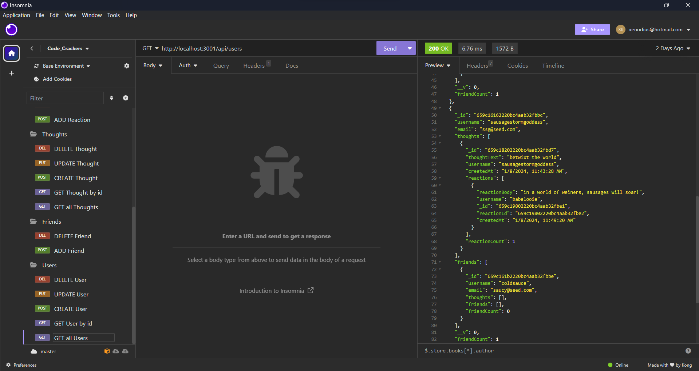
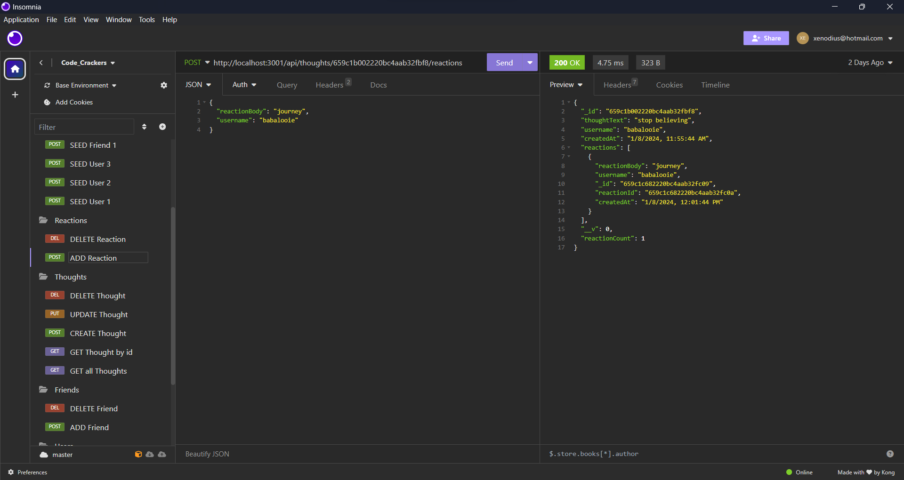
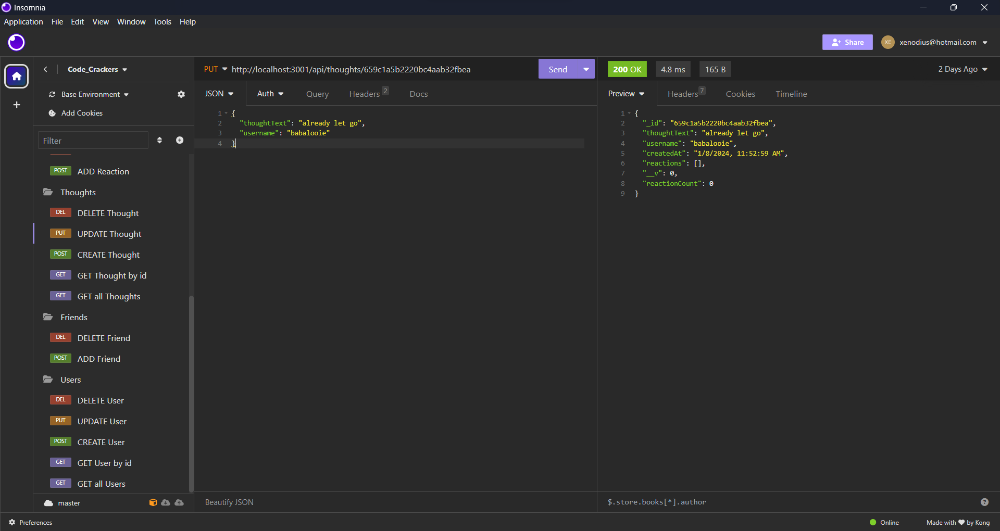
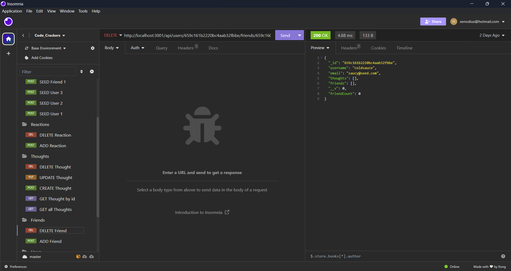

# Code Crackers

## Table of Contents

- [Description](#description)
- [Features](#features)
- [Installation](#installation)
- [Usage](#usage)
- [API Routes](#api-routes)
- [Testing](#testing)
- [Contributing](#contributing)
- [License](#license)
- [Screenshots](#screenshots)
- [Videolink](#videolink)
- [Repository](#repository)
- [Questions](#questions)

## Description

This is a social media API designed for a startup (Code Crackers), providing a robust backend solution for handling large amounts of unstructured data. The API is built using Node.js, Express, and MongoDB with Mongoose as the ODM (Object Data Modeling) library.

## Features

- User and Thought Models: Structured to handle user data, thoughts, and relationships between users.
- CRUD Operations: Supports Create, Read, Update, and Delete operations for users and thoughts.
- Friend Management: Allows adding and removing friends for a user.
- Reaction System: Enables users to add and delete reactions to thoughts.
- NoSQL Database: Utilizes MongoDB to handle unstructured data efficiently.

## Installation

1. Clone the repository:

```bash
git clone https://github.com/XenodiusAlpha/code_crackers.git
```

2. Navigate to the project directory:

```bash
cd code_crackers
```

3. Install dependencies:

```bash
npm install
```

## Usage

1. Start the server and sync Mongoose models with MongoDB:

```bash
npm start
```

2. Open Insomnia or your preferred API testing tool to interact with the provided API routes.

## API Routes

### Users

- **GET /api/users**: Retrieve all users.
- **GET /api/users/:userId**: Retrieve a single user by ID.
- **POST /api/users**: Create a new user.
- **PUT /api/users/:userId**: Update an existing user.
- **DELETE /api/users/:userId**: Delete a user.

### Thoughts

- **GET /api/thoughts**: Retrieve all thoughts.
- **GET /api/thoughts/:thoughtId**: Retrieve a single thought by ID.
- **POST /api/thoughts**: Create a new thought.
- **PUT /api/thoughts/:thoughtId**: Update an existing thought.
- **DELETE /api/thoughts/:thoughtId**: Delete a thought.

### Friends

- **POST /api/users/:userId/friends/:friendId**: Add a friend to a user's friend list.
- **DELETE /api/users/:userId/friends/:friendId**: Remove a friend from a user's friend list.

### Reactions

- **POST /api/thoughts/:thoughtId/reactions**: Add a reaction to a thought.
- **DELETE /api/thoughts/:thoughtId/reactions/:reactionId**: Remove a reaction from a thought.

## Testing

1. Ensure the server is running:

```bash
npm start
```

2. Open Insomnia or your preferred API testing tool.
3. Test the provided API routes based on the acceptance criteria.

## Contributing

Contributions are welcome! Please submit issues or pull requests for any improvements or new features.

## License

This project is licensed under the [MIT License](LICENSE).

## Screenshots





## Videolink
https://drive.google.com/file/d/1RiyUX2WbqSdAPIxLQakn64jUVgce0HW5/view?usp=sharing

# Repository
https://github.com/XenodiusAlpha/code_crackers

## Questions

If you have any questions, feel free to reach out to [xenodius@hotmail.com](mailto:xenodius@hotmail.com) or visit the [GitHub repository](https://github.com/XenodiusAlpha/code_crackers).